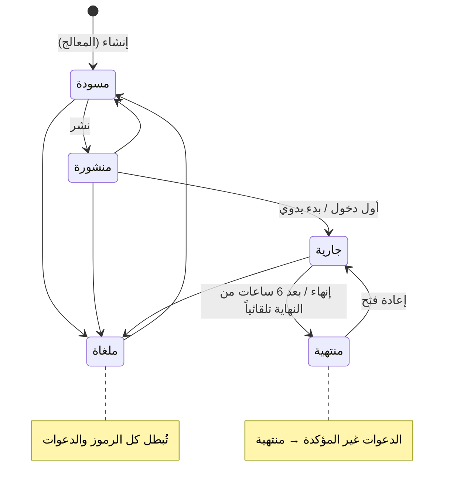
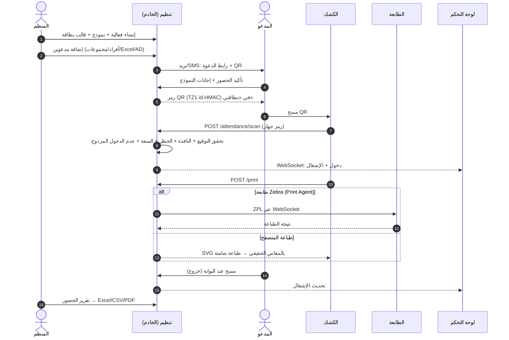
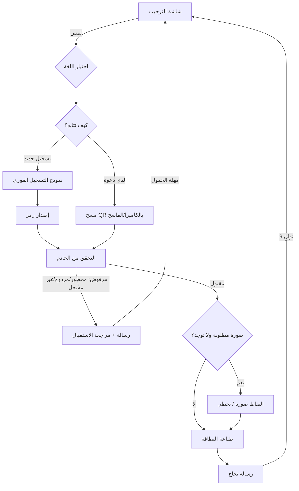
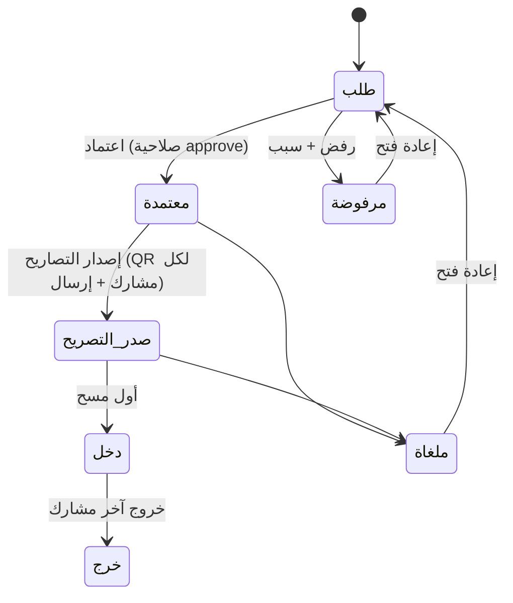
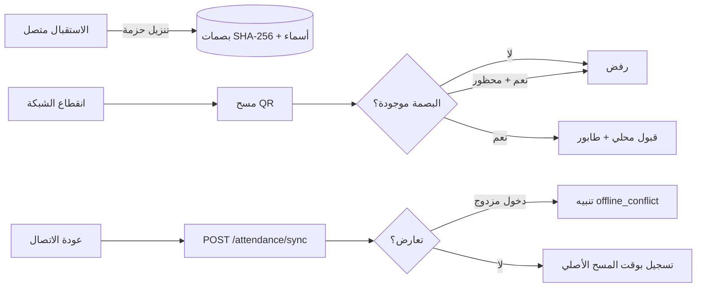
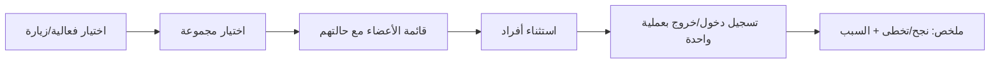

# التدفقات الرئيسية

## دورة حياة الفعالية

```mermaid
stateDiagram-v2
    [*] --> مسودة: إنشاء (المعالج)
    مسودة --> منشورة: نشر
    منشورة --> جارية: أول دخول / بدء يدوي
    منشورة --> مسودة
    جارية --> منتهية: إنهاء / بعد 6 ساعات من النهاية تلقائياً
    منتهية --> جارية: إعادة فتح
    مسودة --> ملغاة
    منشورة --> ملغاة
    جارية --> ملغاة
    ملغاة --> مسودة
    note right of ملغاة: تُبطل كل الرموز والدعوات
    note right of منتهية: الدعوات غير المؤكدة → منتهية
```

## من الدعوة إلى التقرير

```mermaid
sequenceDiagram
    autonumber
    actor م as المنظم
    participant ن as تنظيم (الخادم)
    actor د as المدعو
    participant ك as الكشك
    participant ط as الطابعة
    participant ل as لوحة التحكم
    م->>ن: إنشاء فعالية + نموذج + قالب بطاقة
    م->>ن: إضافة مدعوين (أفراد/مجموعات/Excel/AD)
    ن->>د: بريد/SMS: رابط الدعوة + QR
    د->>ن: تأكيد الحضور + إجابات النموذج
    ن-->>د: رمز QR (TZ1.id.HMAC) في «بطاقتي»
    د->>ك: مسح QR
    ك->>ن: POST /attendance/scan (رمز جهاز)
    ن->>ن: تحقق التوقيع + النافذة + الحظر + السعة + عدم الدخول المزدوج
    ن-->>ل: WebSocket: دخول + الإشغال
    ك->>ن: POST /print
    alt طابعة Zebra (Print Agent)
        ن->>ط: ZPL عبر WebSocket
        ط-->>ن: نتيجة الطباعة
    else طباعة المتصفح
        ن-->>ك: SVG بالمقاس الحقيقي → طباعة صامتة
    end
    د->>ن: مسح عند البوابة (خروج)
    ن-->>ل: تحديث الإشغال
    م->>ن: تقرير الحضور → Excel/CSV/PDF
```

## رحلة الزائر في الكشك

```mermaid
flowchart TD
    A[شاشة الترحيب] -->|لمس| B{اختيار اللغة}
    B --> C{كيف تتابع؟}
    C -->|لدي دعوة| D[مسح QR بالكاميرا/الماسح]
    C -->|تسجيل جديد| E[نموذج التسجيل الفوري] --> F[إصدار رمز]
    F --> G
    D --> G[التحقق من الخادم]
    G -->|مرفوض: محظور/مزدوج/غير مسجل| X[رسالة + مراجعة الاستقبال]
    G -->|مقبول| H{صورة مطلوبة ولا توجد؟}
    H -->|نعم| I[التقاط صورة / تخطي]
    H -->|لا| J
    I --> J[طباعة البطاقة]
    J --> K[رسالة نجاح] -->|9 ثوانٍ| A
    X -->|مهلة الخمول| A
```

## دورة الزيارة

```mermaid
stateDiagram-v2
    [*] --> طلب
    طلب --> معتمدة: اعتماد (صلاحية approve)
    طلب --> مرفوضة: رفض + سبب
    معتمدة --> صدر_التصريح: إصدار التصاريح (QR لكل مشارك + إرسال)
    صدر_التصريح --> دخل: أول مسح
    دخل --> خرج: خروج آخر مشارك
    معتمدة --> ملغاة
    صدر_التصريح --> ملغاة
    مرفوضة --> طلب: إعادة فتح
    ملغاة --> طلب: إعادة فتح
```

## التحقق دون اتصال (الوضع الاحتياطي)

```mermaid
flowchart LR
    A[الاستقبال متصل] -->|تنزيل حزمة| B[(بصمات SHA-256 + أسماء)]
    C[انقطاع الشبكة] --> D[مسح QR] --> E{البصمة موجودة؟}
    E -->|لا| R[رفض]
    E -->|نعم + محظور| R
    E -->|نعم| F[قبول محلي + طابور]
    G[عودة الاتصال] --> H[POST /attendance/sync]
    H --> I{تعارض؟}
    I -->|دخول مزدوج| N[تنبيه offline_conflict]
    I -->|لا| J[تسجيل بوقت المسح الأصلي]
```

## الحضور الجماعي

```mermaid
flowchart LR
    A[اختيار فعالية/زيارة] --> B[اختيار مجموعة] --> C[قائمة الأعضاء مع حالتهم]
    C --> D[استثناء أفراد] --> E[تسجيل دخول/خروج بعملية واحدة] --> F[ملخص: نجح/تخطى + السبب]
```
